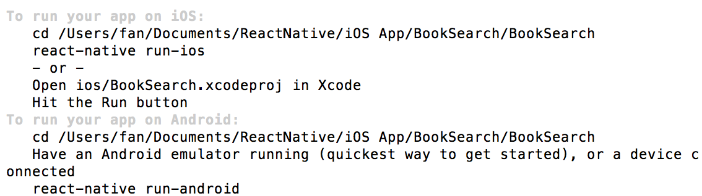
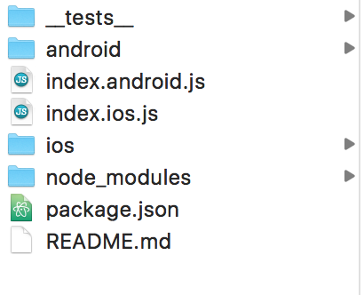
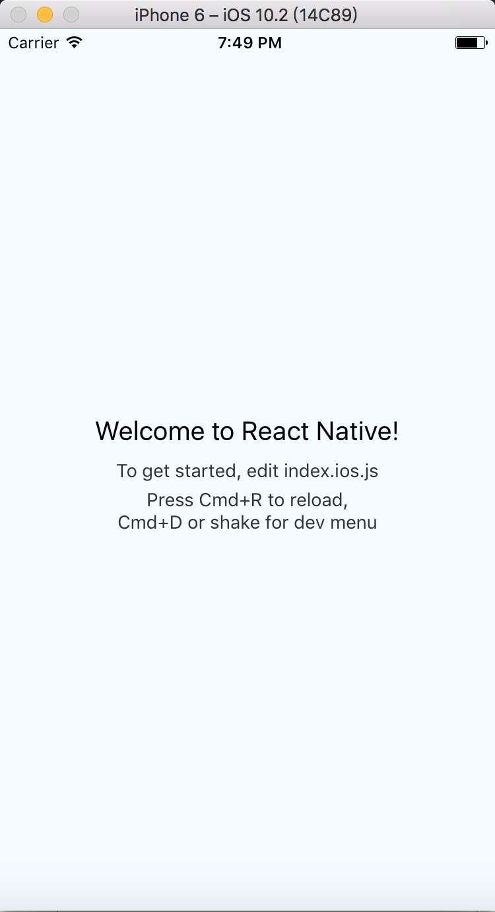

# ReactNative
## 安裝環境 Mac Terminal
### 安裝 Homebrew 管理工具
> http://brew.sh/

### Node.js
> 使用Node.js來建構javascript程式
> 
使用Homebrew來安裝Node.js
>  <code>brew install node</code>

### watchman
> 用於偵測程式碼的變化，以便重新建構(FB檔案監控工具)
> 
使用Homebrew來安裝watchman
>  <code>brew install watchman</code>

### npm
> Node package Manager (Node套件管理員)
> 
使用npm來安裝React Native CLI工具
>  <code>npm install -g react-native-cli</code>

## 創建專案(切到該資料夾下)
> <code>react-native init BookSearch</code>
>  
> 
產生之檔案目錄
>  
> 
使用Xcode開啟專案並執行
>  
